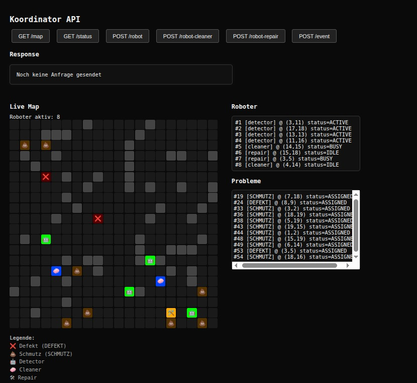
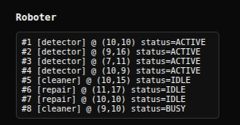
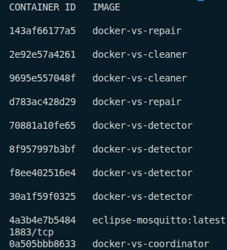
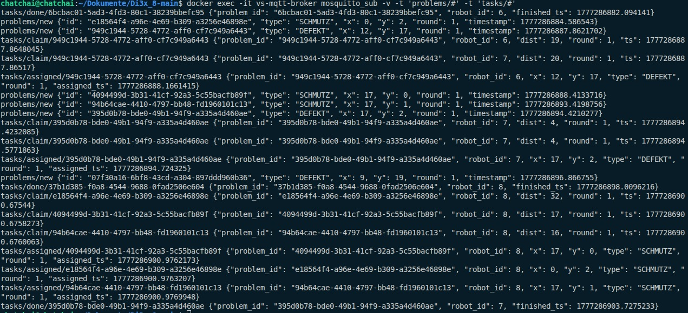
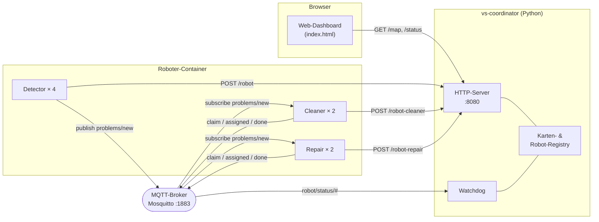

# Verteilte Systeme – Autonome Roboter für Gebäudemanagement

> Ein verteiltes, containerisiertes System, das autonome Roboter beim Gebäudemanagement simuliert.
> Detector-, Cleaner- und Repair-Bots koordinieren sich **vollständig dezentral** über MQTT, ohne zentralen Dispatcher.

[](https://github.com/Chatchai-lab/distributed-robots-building-management/actions/workflows/ci.yml)


---

## Inhaltsverzeichnis

1. [Screenshots](#1-screenshots)
2. [Projektübersicht](#2-projektübersicht)
3. [System-Architektur](#3-system-architektur)
4. [Tech-Stack](#4-tech-stack)
5. [Quickstart](#5-quickstart)
6. [Projektstruktur](#6-projektstruktur)
7. [Komponenten im Detail](#7-komponenten-im-detail)
8. [Kommunikation – MQTT-Topics & HTTP-API](#8-kommunikation--mqtt-topics--http-api)
9. [Dezentrale Aufgabenvergabe & Fehlertoleranz](#9-dezentrale-aufgabenvergabe--fehlertoleranz)
10. [Tests](#10-tests)
11. [Troubleshooting](#11-troubleshooting)
12. [Roadmap & weiterführende Ideen](#12-roadmap--weiterführende-ideen)
13. [Autoren & Lizenz](#13-autoren--lizenz)

---

## 1. Screenshots

> Die folgenden Screenshots werden in [docs/images/](docs/images/) abgelegt und unten eingebunden.
> **Aktuell sind dies Platzhalter** – bitte die echten Bilder mit den vorgesehenen Dateinamen ergänzen.

### 1.1 Web-Dashboard – Hauptansicht der Karte
*Zeigen: 2D-Gebäudekarte mit allen Robotern, offenen/zugewiesenen Problemen und Legende.*


<!-- TODO: Screenshot speichern unter docs/images/dashboard_overview.png -->

### 1.2 Roboter-Status-Tabelle
*Zeigen: Liste aller registrierten Bots mit Rolle (Detector/Cleaner/Repair), Status (IDLE/BUSY) und letzter Position.*


<!-- TODO: Screenshot speichern unter docs/images/dashboard_robots.png -->

### 1.3 Live-Problem-Lifecycle
*Zeigen: Ein Problem im Verlauf – Erkennung durch Detector → Claim → Zuweisung → Bearbeitung → Abschluss.*


<!-- TODO: Screenshot speichern unter docs/images/problem_lifecycle.png -->

### 1.4 Watchdog & Recovery
*Zeigen: Dashboard im Moment, in dem ein Bot ausfällt und sein Task neu vergeben wird (`round` erhöht).*


<!-- TODO: Screenshot speichern unter docs/images/watchdog_recovery.png -->

### 1.5 Docker-Compose – laufende Container
*Zeigen: Output von `docker compose ps` mit allen Services (`vs-mqtt-broker`, `vs-coordinator`, 4× Detector, 2× Cleaner, 2× Repair).*


<!-- TODO: Screenshot speichern unter docs/images/docker_compose_ps.png -->

### 1.6 MQTT-Verkehr (mosquitto_sub)
*Zeigen: Live-Auszug der Topics `problems/new`, `tasks/claim/#`, `tasks/assigned/#`, `tasks/done/#`.*


<!-- TODO: Screenshot speichern unter docs/images/mqtt_traffic.png -->

---

## 2. Projektübersicht

Ziel des Projekts ist ein **verteiltes, containerisiertes System** zur Simulation autonomer Roboter im Gebäudemanagement.
Im Fokus stehen die typischen Konzepte verteilter Systeme:

- **Verteilte Kommunikation** über MQTT (Pub/Sub) und HTTP
- **Lose Kopplung** der Komponenten
- **Dezentrale Koordination** ohne Single Point of Failure bei der Aufgabenvergabe
- **Fehlertoleranz** durch Watchdog & Re-Assignment
- **Skalierbarkeit** durch Container-Replikate

### Akteure

| Rolle | Aufgabe |
|------|---------|
| **Detector-Bots** | Erkennen Probleme (`SCHMUTZ`, `DEFEKT`) auf der Karte |
| **Cleaner-Bots** | Beheben `SCHMUTZ`-Probleme |
| **Repair-Bots** | Beheben `DEFEKT`-Probleme |
| **Koordinator** | Verwaltet Karte, Registrierung, Dashboard, Watchdog |
| **MQTT-Broker** | Entkoppelter Nachrichten-Bus |

---

## 3. System-Architektur



**Kommunikationsmuster:**

- **HTTP** für Registrierung und Lese-API (Karte, Status) – einmalige bzw. seltene Anfragen
- **MQTT (Pub/Sub)** für alle laufenden Ereignisse (Probleme, Claims, Status-Heartbeats)
- **Keine direkte Bot-zu-Bot-Kopplung** – alle Nachrichten gehen über den Broker

---

## 4. Tech-Stack

| Bereich | Technologie |
|--------|-------------|
| Sprache (Backend) | **Python 3.11** |
| Messaging | **Eclipse Mosquitto** (MQTT 3.1.1) |
| Python-MQTT-Client | `paho-mqtt` |
| HTTP | manuell implementiert über TCP-Sockets (Lerneffekt) |
| Optional / Tests | `grpcio`, `grpcio-tools`, `protobuf`, `requests` |
| Frontend | Plain **HTML / JS / CSS** (single-page) |
| Containerisierung | **Docker** & **Docker Compose** |
| Test-Framework | `pytest` |

---

## 5. Quickstart

### Voraussetzungen

- [Docker](https://docs.docker.com/engine/install/) ≥ 24
- [Docker Compose Plugin](https://docs.docker.com/compose/install/) ≥ v2
- Freie Ports: `1883` (MQTT), `8080`, `8181`, `50050` (Koordinator)

### Starten

```bash
git clone <repo-url> Di3x_8
cd Di3x_8/docker

docker compose down -v
docker compose build --no-cache
docker compose up
```

Der erste Build dauert je nach Maschine ein paar Minuten.

### Zugriff

| Dienst | URL / Port |
|--------|-----------|
| Web-Dashboard | <http://localhost:8080> |
| Koordinator (zusätzlich) | `:8181`, `:50050` |
| MQTT-Broker | `localhost:1883` |

### Stoppen & Aufräumen

```bash
# Im laufenden Terminal: Ctrl+C
docker compose down -v   # entfernt auch Volumes
```

### Skalierung anpassen

In [docker/docker-compose.yml](docker/docker-compose.yml) lassen sich die `replicas` der Bot-Services frei ändern, z. B.:

```yaml
vs-cleaner:
  deploy:
    replicas: 5
```

---

## 6. Projektstruktur

```
Di3x_8-main/
├── .github/workflows/        # CI/CD-Pipelines (GitHub Actions)
│   └── ci.yml
├── backend/                  # Python-Quellcode aller Komponenten
│   ├── coordinator.py        # Koordinator: HTTP-API, Watchdog, Dashboard-Daten
│   ├── detector.py           # Detector-Bot (Bewegung & Problemerkennung)
│   ├── ServiceBot.py         # Cleaner / Repair Service-Bot
│   └── RobotLogic.py         # Gemeinsame Logik (Karte, BFS-Pfad, Helpers)
│
├── frontend/
│   └── index.html            # Web-Dashboard (Karte, Status, Live-Updates)
│
├── docker/
│   ├── docker-compose.yml    # Orchestrierung aller Services
│   ├── coordinator/Dockerfile
│   ├── detector/Dockerfile
│   ├── servicebot-cleaner/Dockerfile
│   └── servicebot-repair/Dockerfile
│
├── requirements/             # Pinned Dependencies pro Service
│   ├── coordinator.txt
│   ├── detector.txt
│   └── servicebot.txt
│
├── tests/                    # pytest-Suite
│   ├── test_coordinator.py
│   ├── mqtt.py
│   ├── rpc.py
│   └── aufgabe5.py
│
├── docs/
│   ├── test_docu.md          # Test-Dokumentation
│   └── images/               # Screenshots & Diagramme
│
├── pytest.ini                # pytest-Konfiguration
├── requirements.txt          # Top-Level Dev-Requirements
└── README.md
```

---

## 7. Komponenten im Detail

### 7.1 Koordinator

- Erzeugt beim Start eine zufällige **2D-Gebäudekarte**
- Registriert Roboter über HTTP-Endpunkte
- Verarbeitet Statusmeldungen via MQTT
- Stellt das **Web-Dashboard** unter `:8080` bereit
- Überwacht alle Bots per **Watchdog**

> Die HTTP-Schicht (Header, Body, Content-Length) wurde **bewusst manuell** auf TCP-Sockets implementiert – ein Lernziel des Praktikums.

### 7.2 Detector-Bot

- Registrierung beim Koordinator
- Bewegung auf der Karte (N4-Nachbarschaft)
- Zufällige Erkennung von Problemen (`SCHMUTZ` / `DEFEKT`)
- Veröffentlicht Probleme über MQTT
- **Kennt keine Service-Bots** – vollständige Entkopplung

### 7.3 Service-Bots (Cleaner & Repair)

| Bot     | Zuständig für |
|--------|----------------|
| Cleaner | `SCHMUTZ`     |
| Repair  | `DEFEKT`      |

Jeder Service-Bot:

- registriert sich beim Koordinator
- empfängt `problems/new` und entscheidet **lokal**, ob er sich bewirbt
- nimmt am Claim-Verfahren teil
- führt nach Zuweisung BFS-Pfadberechnung & Bewegung durch
- meldet kontinuierlich Heartbeats über `robot/status/<id>`

---

## 8. Kommunikation – MQTT-Topics & HTTP-API

### 8.1 MQTT-Topics

| Topic | Richtung | Inhalt |
|-------|----------|--------|
| `problems/new` | Detector → alle Service-Bots | Neues erkanntes Problem |
| `tasks/claim/<problem_id>` | Service-Bot → alle | Bewerbung mit Distanz & `round` |
| `tasks/assigned/<problem_id>` | Gewinner → alle | Zuweisung |
| `tasks/done/<problem_id>` | Service-Bot → Koordinator | Abschlussmeldung |
| `robot/status/<robot_id>` | jeder Bot → Koordinator | Heartbeat & aktuelle Position |

### 8.2 Beispiel-Payload `problems/new`

```json
{
  "id": "uuid",
  "type": "SCHMUTZ",
  "x": 4,
  "y": 7,
  "round": 1,
  "timestamp": "2025-01-24T13:39:00Z"
}
```

### 8.3 HTTP-API des Koordinators

| Endpoint | Methode | Beschreibung |
|--------|--------|-------------|
| `/robot` | POST | Registrierung eines Detector-Bots |
| `/robot-cleaner` | POST | Registrierung eines Cleaner-Bots |
| `/robot-repair` | POST | Registrierung eines Repair-Bots |
| `/map` | GET | Aktuelle Karte inkl. Roboter & Probleme |
| `/status` | GET | Übersicht aller Roboter |

---

## 9. Dezentrale Aufgabenvergabe & Fehlertoleranz

### 9.1 Claim-Verfahren (Leader Election)

1. Detector veröffentlicht `problems/new`
2. Jeder geeignete & idle Service-Bot:
   - berechnet die **Manhattan-Distanz**
   - sendet einen Claim mit `robot_id`, Distanz, `round`, Zeitstempel
3. Nach kurzer Wartezeit entscheidet jeder Bot **lokal** identisch:
   - **Gewinner** = kleinste Distanz, bei Gleichstand kleinste `robot_id`
4. Gewinner publiziert `tasks/assigned/<problem_id>`

### 9.2 Konsistenz-Mechanismen

- lokales `started`-Set verhindert Doppelbearbeitung
- Claims aus alten `round`s werden ignoriert
- Tasks starten nur im Zustand `IDLE`

### 9.3 Watchdog

- Bots senden periodisch `robot/status/<id>` (Heartbeat)
- Bleibt der Heartbeat **> 10 s** aus:
  - Bot gilt als ausgefallen
  - sein Task wird freigegeben
  - Problem wird mit erhöhter `round` über `problems/new` neu publiziert
- Andere Service-Bots übernehmen automatisch

---

## 10. Tests & CI/CD

### Lokal ausführen

Die Tests sind **Integrationstests** und brauchen den laufenden Compose-Stack:

```bash
# 1) Stack starten
cd docker && docker compose up -d --build && cd ..

# 2) Testabhängigkeiten
pip install "pytest>=8" "pytest-timeout>=2" "requests>=2.31" "paho-mqtt<2.0"

# 3) Tests laufen lassen
pytest -v
```

Testabdeckung:

- Koordinator-HTTP ([tests/test_coordinator.py](tests/test_coordinator.py))
- MQTT-Flows ([tests/mqtt.py](tests/mqtt.py))
- Dezentrale Aufgabenvergabe ([tests/aufgabe5.py](tests/aufgabe5.py))
- RPC / gRPC-Pfad ([tests/rpc.py](tests/rpc.py)) – benötigt zusätzlich generierte protobuf-Stubs

### Continuous Integration (GitHub Actions)

Bei jedem Push / PR auf `main` läuft die Pipeline in [.github/workflows/ci.yml](.github/workflows/ci.yml):

1. **build** – baut alle Docker-Images
2. **integration-tests** – startet den vollständigen Compose-Stack, wartet auf Coordinator & MQTT, führt die Integrationstests aus und sammelt bei Fehler die Container-Logs

Status: siehe Badge oben.

Detaillierte Testdokumentation und Screenshots der Ergebnisse: [docs/test_docu.md](docs/test_docu.md).

---

## 11. Troubleshooting

| Symptom | Ursache | Lösung |
|--------|---------|--------|
| `port is already allocated` | Port `1883`/`8080` belegt | Belegende Prozesse stoppen oder Ports in [docker-compose.yml](docker/docker-compose.yml) ändern |
| Dashboard zeigt keine Bots | Bots starteten vor Broker | `docker compose down -v && docker compose up` |
| Bots disconnecten ständig | DNS/Netzwerk im Compose-Netz | `docker network prune` und neu starten |
| Build sehr langsam | Cache zerschossen | einmaliges `docker compose build --no-cache`, danach normal |
| Watchdog markiert alle Bots als tot | System-Uhr / Container-Uhr abweichend | Host-Uhr synchronisieren (`timedatectl`) |

Logs eines einzelnen Service ansehen:

```bash
docker compose logs -f vs-coordinator
docker compose logs -f vs-cleaner
```

---

## 12. Roadmap & weiterführende Ideen

- [ ] TLS-gesicherter MQTT-Broker (Mosquitto + Zertifikate)
- [ ] Persistenz der Karte & Probleme (z. B. Redis)
- [ ] Prometheus-Metriken + Grafana-Dashboard
- [ ] Heterogene Bots mit Energie-/Akku-Modell
- [ ] Re-Planning bei dynamischen Hindernissen

---

## 13. Autoren & Lizenz

**Modul:** Verteilte Systeme – Praktikum
**Autor:innen:** Projektgruppe Di3x_8

Dieses Projekt ist im akademischen Kontext entstanden und steht ausschließlich zu Lehr- und Lernzwecken zur Verfügung.
