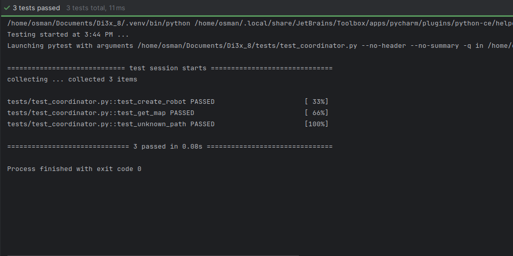
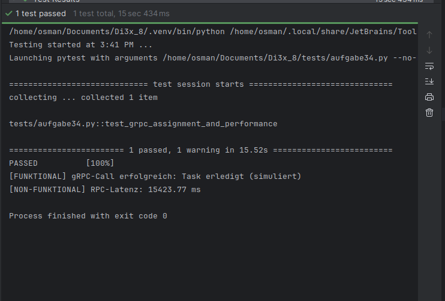
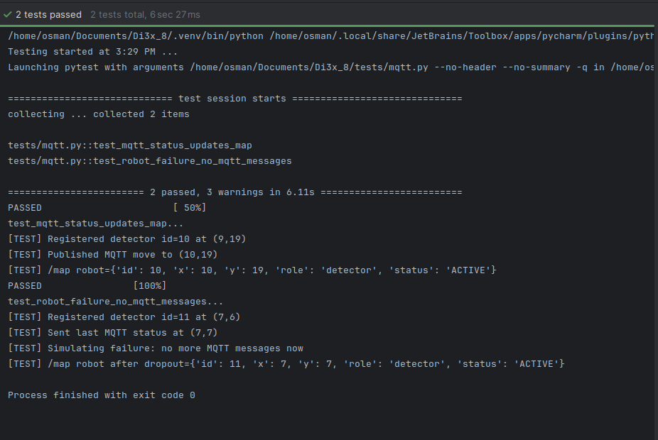
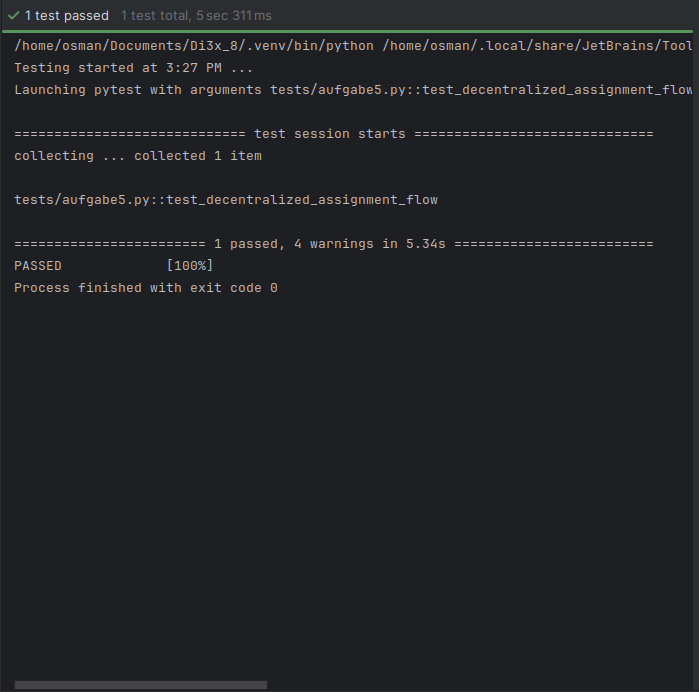
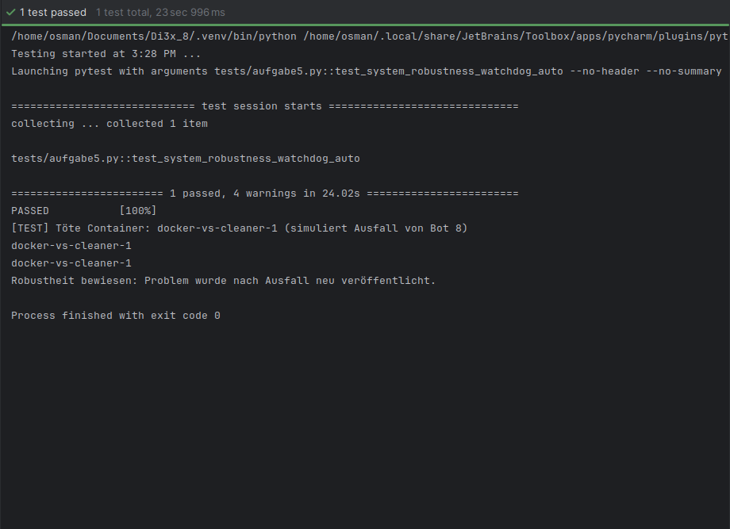
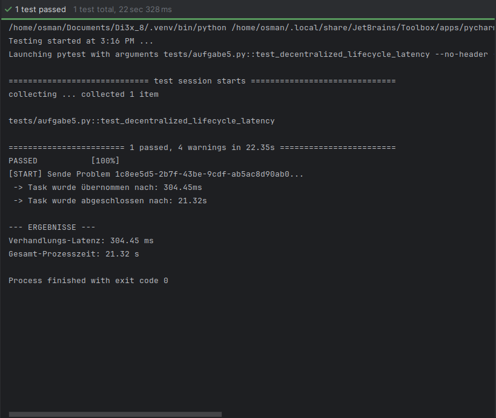

# Tests und Validierung

Zum Starten der Anwendung müssen die Docker-Images im Stammverzeichnis gebaut und gestartet werden:

```bash
cd docker
docker compose down -v 
docker compose build --no-cache
docker compose up
```


## Aufgabe 1 - Koordinator Tests
Zur Überprüfung der grundlegenden Funktionalität des Koordinators wurden REST-Schnittstellen-Tests durchgeführt.

---
### test_create_robot (Funktionaler Test)
Dieser Test validiert das dynamische Hinzufügen von Robotern zum System.
* **Ablauf:** Es wird ein POST-Request an den Endpunkt `/robot` gesendet.
* **Validierung:** Der Test stellt sicher, dass der Koordinator mit dem Statuscode 200 antwortet und ein valides JSON-Objekt zurückgibt, welches eine eindeutige `id`, die Start-`position` sowie das aktuelle `map`-Layout enthält.


---
### test_get_map (Funktionaler Test)
Dieser Test prüft die korrekte Bereitstellung des digitalen Abbilds der Einsatzumgebung (Grid).
* **Ablauf:** Nach der Initialisierung eines Roboters wird der GET-Endpunkt `/map` aufgerufen.
* **Validierung:** Es wird geprüft, ob die API das Grid als Liste von Strings zurückgibt, wobei jede Zeile der Karte korrekt serialisiert ist. Dies ist die Grundlage für die Visualisierung im Frontend.
---
### test_unknown_path (Nicht-funktionaler Test)
Ein Negativ-Test zur Überprüfung der Fehlerbehandlung des API-Gateways.
* **Ablauf:** Es wird ein Request an einen nicht existierenden Pfad (`/xyz`) gesendet.
* **Validierung:** Der Test bestätigt, dass das System robust reagiert und einen entsprechenden Fehlercode (Status 400) zurückgibt, anstatt undefinierte Zustände einzunehmen.
---



Zum Ausführen der Tests wird pytest benötigt. Zu Beginn muss in das `/test` Verzeichnis gewechselt werden, daraufhin kann der Test aufgerufen werden.
```bash
cd tests
pytest test_coordinator.py -s -v
```
---

## Aufgabe 2 - gRPC-Tests (Zentrale Steuerung)
Dieser Test validiert die direkte Steuerung eines Service-Bots über das gRPC-Protokoll.

---
* **Funktionaler Aspekt:** Der Test prüft die Methode `AssignTask`. Es wird verifiziert, ob der Bot typsichere Parameter (ID, Typ, Position) empfängt, die Aufgabe korrekt quittiert (`response.ok`) und den Status auf beschäftigt setzt.
* **Nicht-funktionaler Aspekt:** Es wird die Round-Trip-Latenz des RPC-Aufrufs gemessen. Da der Call blockierend ist, umfasst die Messung die gesamte Dauer der simulierten Bearbeitung. Ein Grenzwert von 25 Sekunden stellt sicher, dass der Bot die Aufgabe innerhalb eines realistischen Zeitrahmens abschließt.


**Ergebnis:** Der Test bestätigt die synchrone Kopplung zwischen Koordinator und Bot sowie die Stabilität der Verbindung während der gesamten Ausführungsdauer.
---




```bash
cd tests
pytest rpc.py -s -v
```

---

## Aufgabe 3 - MQTT-Tests

Zur Überprüfung, ob die Kommunikation mit MQTT funktioniert wurden folgende beiden Tests durchgeführt

---

### test_mqtt_status_updates_map (Funktionaler Test)
Der Test erstellt einen weiteren Detektor-Bot und sendet eine vorher definierte Bewegung mittels MQTT an den Koordinator. Danach wird der /map Endpunkt des Koordinators aufgerufen und es wird überprüft ob die Bewegung korrekt übermittelt wurde und der Roboter an der korrekten Postion ist.

--- 

### test_robot_failure_no_mqtt_messages (Nicht-funktionaler Test)
Bei diesem Test wird ebenfalls eine Bewegung eines Detektor-Bots simuliert und danach  keine Bewegung mehr gesendet um zu Überprüfen, ob der Systemzustand konsistent ist. Ergebnis davon ist, dass falls die Kommunikation fehlschlägt und es zum Stehenbleiben des ausgefallenen Robotors kommt. 

---




```bash
cd tests
pytest mqtt.py -s -v
```

--- 

## Aufgabe 5 - Dezentrale Koordination

Zur Überprüfung, ob die Kommunikation mit MQTT funktioniert wurden folgende beiden Tests durchgeführt

---

### test_decentralized_assignment_flow (Funktionaler Test)
Dieser Test verifiziert die autonome Verhandlung und Aufgabenübernahme durch die Service-Bots via MQTT (Aufgabe 5).

* **Funktionaler Aspekt:** Es wird geprüft, ob die Bots ohne zentrale Steuerung eine "Leader Election" durchführen. Der Test publiziert ein neues Problem auf das Topic `problems/new` und wartet auf eine Reaktion aus dem Bot-Netzwerk.
* **Validierung:** Der Test abonniert das Topic `tasks/assigned/#`. Er gilt als bestanden, wenn innerhalb von 5 Sekunden mindestens ein Service-Bot den Task autonom beansprucht und die korrekte `problem_id` zurückmeldet.


**Ergebnis:** Der Test bestätigt, dass die dezentrale Logik zur Aufgabenverteilung funktioniert und die Bots eigenständig auf Umgebungsereignisse reagieren.



--- 

### test_system_robustness_watchdog_auto (Nicht-funktionaler Test)
Dieser Test weist die Fehlertoleranz und Robustheit des Gesamtsystems bei einem plötzlichen Prozessausfall nach (Aufgabe 5).

* **Funktionaler Aspekt:** Es wird simuliert, dass ein Service-Bot während der Bearbeitung eines Tasks abstürzt. Der Test nutzt Docker-Befehle (`docker stop`), um den Container des aktiven Bots gewaltsam zu beenden.
* **Validierung:** Der Koordinator muss den Ausfall über den fehlenden MQTT-Heartbeat (Watchdog) erkennen. Der Test ist erfolgreich, wenn der Koordinator das Problem automatisch mit einer erhöhten `round`-Nummer neu auf das Topic `problems/new` publiziert.


**Ergebnis:** Die Robustheit wird bewiesen, indem das System den Ausfall erkennt und sicherstellt, dass die Aufgabe nicht im System "verloren" geht, sondern für andere Bots wieder freigegeben wird.

---


---

### test_decentralized_lifecycle_latency (Nicht-funktional Test)
Dieser Test bewertet die Performance und die zeitliche Effizienz der dezentralen Event-Architektur (Aufgabe 5).

* **Funktionaler Aspekt:** Der Test bildet den vollständigen "End-to-End" Lebenszyklus eines Ereignisses ab. Er trackt den Weg einer Aufgabe von der Veröffentlichung (`problems/new`) über die autonome Zuweisung (`tasks/assigned`) bis hin zur finalen Erledigungsmeldung (`tasks/done`).
* **Nicht-funktionaler Aspekt:** Es werden zwei kritische Latenzwerte gemessen und validiert:
    1. **Verhandlungs-Latenz:** Die Zeit, die das System benötigt, um dezentral eine Entscheidung zu treffen (~300 ms).
    2. **Gesamt-Prozesszeit:** Die Gesamtdauer inklusive Pfadberechnung, Anfahrt und Arbeitszeit (~33 s).


**Ergebnis:** Der Test verifiziert, dass die nachrichtentechnische Steuerung hocheffizient ist und die physikalische Simulation (Arbeitszeit des Bots) korrekt abgebildet wird. Ein automatisierter Timeout stellt sicher, dass das System innerhalb definierter Performance-Grenzen reagiert.



```bash
cd tests
pytest aufgabe5.py -s -v
```

---